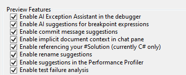

# Current List of Preview Features

As of 19-March-2024, this is the list of preview features:

To view the updated list, on Visual Studio 2022, go to Tools > Options and search for GitHub Chat.

Let's check out some of these features.

# Debug with Copilot

## 1. Enable AI suggestions for breakpoint expressions

1. Open Visual Studio
2. Create a new project > Console App
3. Name it **ConsoleApp_Copilot**
4. Replace the default code in _Program.cs_ with the following code:

        using System;
        using System.Collections.Generic;
        
        public class Example
        {
            public static void Main(string[] args)
            {
                int value = Int32.Parse(args[0]);
                // print the value of the argument
                Console.WriteLine("The value of the argument is: " + value);
                List<String> names = null;
                if (value > 0)
                    names = new List<String>();
        
                names.Add("La Ley");
                // print the list of names
                Console.WriteLine("The list of names is: " + names);
            }
        }

> ENSURE that **Debug > 'AppName' Debug Properties > Command line arguments** is empty to begin with. Later test with a random number.

6. Right-click the following statement and choose **Breakpoint > Insert Breakpoint**

        int value = Int32.Parse(args[0]);
7. Press F5 or select **Start Debugging** from the Debug menu.\
    The app pauses at the breakpoint. The Autos window shows that the args variable has a value of `string[0]`.

8. Right-click in the code and choose Ask Copilot to open the inline Chat view.
9. Type the following question in the inline Chat view:

        Why does the args variable have a value of string[0]?
If Copilot has a suggested fix for your code, it shows you. If not, you can ask Copilot for a code suggestion. You can prompt **/fix** in the inline chat.

After accepting the solution, try to add more documentation through copilot chat by prompting **/doc**

**Cancel the changes so that we can continue with this demo.**

## 2. Enable AI Exception Assistant in the debugger

1. Remove the breakpoint
2. Run Debug > **Start Debugging**
3. Ask Copilot to fix the issue in the code

5. Debug the code again

## 3. Enable suggestions in the Performance Profiler

Use this code:

    using System;
    using System.Threading;

    class HighCPUUsage
    {
        static void Main()
        {
            Console.WriteLine("Running high CPU load for 10 seconds...");
            DateTime endTime = DateTime.Now.AddSeconds(10); // Run for 10 seconds

            while (DateTime.Now < endTime)
            {
                // Perform some meaningless computation to keep CPU busy
                double result = Math.Pow(Math.PI, Math.E) * Math.Sqrt(Math.Log10(Math.PI * Math.E));
            }

            Console.WriteLine("High CPU load complete.");
        }
    }

Run Debug > **Performance Profiler** (Select CPU Usage)

In the Top Insights, select the **Ask Copilot** option to get recommendations.

Here's a potential before and after of the Performance enhancement:

**BEFORE**

**AFTER**

## 4. Enable test failure analysis

# Other Preview Features

## 3. Enable commit message suggestions

Once you are ready to commit your new changes, you can see the following option (Visual Studio 2022):

## 4. Enable referencing your #Solution (currently C# only)

## 5. Enable rename suggestions

[Reference](https://devblogs.microsoft.com/visualstudio/ai-powered-rename-suggestions/).
