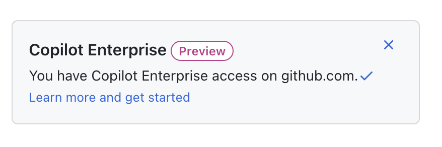
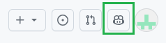

## Current situation
As a Microsoft employee, you should have access to Copilot Enterprise via you _Microsoft account. You can verify this by going to [aka.ms/copilot](aka.ms/copilot). 
Look for this block on the right of the page. 

## Demo

### Chat with an Open Source codebase
GitHub has indexed 1000s of largest open source repositories. Some examples are

- [Web-Dev-For-Beginners](https://github.com/microsoft/Web-Dev-For-Beginners) - 24 lessons dive into JavaScript, CSS, and HTML through hands-on projects
- [Maui-Samples](https://github.com/dotnet/maui-samples) - Samples built with .NET Multi-platform App UI (.NET MAUI).
- [eShop](https://github.com/dotnet/eShop) - A reference .NET application implementing an eCommerce web site
- [.Net Samples](https://github.com/dotnet/samples) - .Net Samples
- [Azure-Samples Open AI Demo](https://github.com/Azure-Samples/azure-search-openai-demo) - Azure-Samples Open AI Demo

If you go to any of these sites you can open up the Copilot chat dialog in the browser. 

Note the text : *Indexed for improved understanding and accuracy* In the Chat dialog that shows up. 

Try asking a couple of high level questions like. 
 - What does this project do
 - What will be happen if I run this project?
 - What would I have to do if I wanted to run this project on my local computer?
